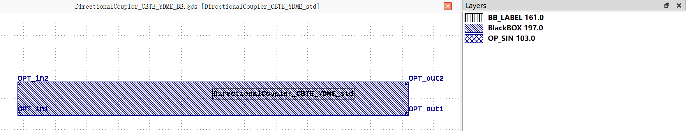

DirectionalCoupler_CBTE_YDME
#############################

+-------------------+-----------------------------+------------------------+------------------------+-------------+
|     Name          | Type                        | Position               | Waveguide Type         | Degrees     |
+===================+=============================+========================+========================+=============+
| OPT_in1           | Optical                     | (-62, -4.9)            | TECH.WG.STRIP.C.WIRE   | 180         |
+-------------------+-----------------------------+------------------------+------------------------+-------------+
| OPT_in2           | Optical                     | (-62, 4.9)             | TECH.WG.STRIP.C.WIRE   | 180         |
+-------------------+-----------------------------+------------------------+------------------------+-------------+
| OPT_out1          | Optical                     | (62, -4.9)             | TECH.WG.STRIP.C.WIRE   | 0           |
+-------------------+-----------------------------+------------------------+------------------------+-------------+
| OPT_out2          | Optical                     | (62, 4.9)              | TECH.WG.STRIP.C.WIRE   | 0           |
+-------------------+-----------------------------+------------------------+------------------------+-------------+
