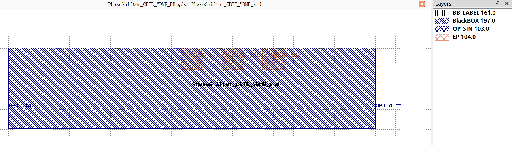

PhaseShifter_CBTE_YDME
#############################

+-------------------+-----------------------------+------------------------+------------------------+-------------+
|     Name          | Type                        | position               | Waveguide Type         | Degrees     |
+===================+=============================+========================+========================+=============+
| OPT_in1           | Optical                     | (-450, 0)              | TECH.WG.STRIP.C.WIRE   | 180         |
+-------------------+-----------------------------+------------------------+------------------------+-------------+
| OPT_out1          | Optical                     | (450, 0)               | TECH.WG.STRIP.C.WIRE   | 0           |
+-------------------+-----------------------------+------------------------+------------------------+-------------+
| ELEC_in1          | Electrical                  | (0, 125)               | TECH.METAL.M1.W20      | 90          |
+-------------------+-----------------------------+------------------------+------------------------+-------------+
| ELEC_in2          | Electrical                  | (100, 125)             | TECH.METAL.M1.W20      | 90          |
+-------------------+-----------------------------+------------------------+------------------------+-------------+
| ELEC_in3          | Electrical                  | (200, 125)             | TECH.METAL.M1.W20      | 90          |
+-------------------+-----------------------------+------------------------+------------------------+-------------+

