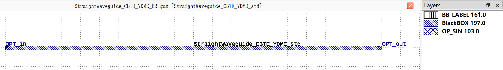

StripWaveguide_CBTE_YDME
#############################

+-------------------+-----------------------------+------------------------+------------------------+-------------+
|     Name          | Type                        | Position               | Waveguide Type         | Degrees     |
+===================+=============================+========================+========================+=============+
| OPT_in            | Optical                     | (0, 0)                 | TECH.WG.STRIP.C.WIRE   | 180         |
+-------------------+-----------------------------+------------------------+------------------------+-------------+
| OPT_out           | Optical                     | (100, 0)               | TECH.WG.STRIP.C.WIRE   | 0           |
+-------------------+-----------------------------+------------------------+------------------------+-------------+

