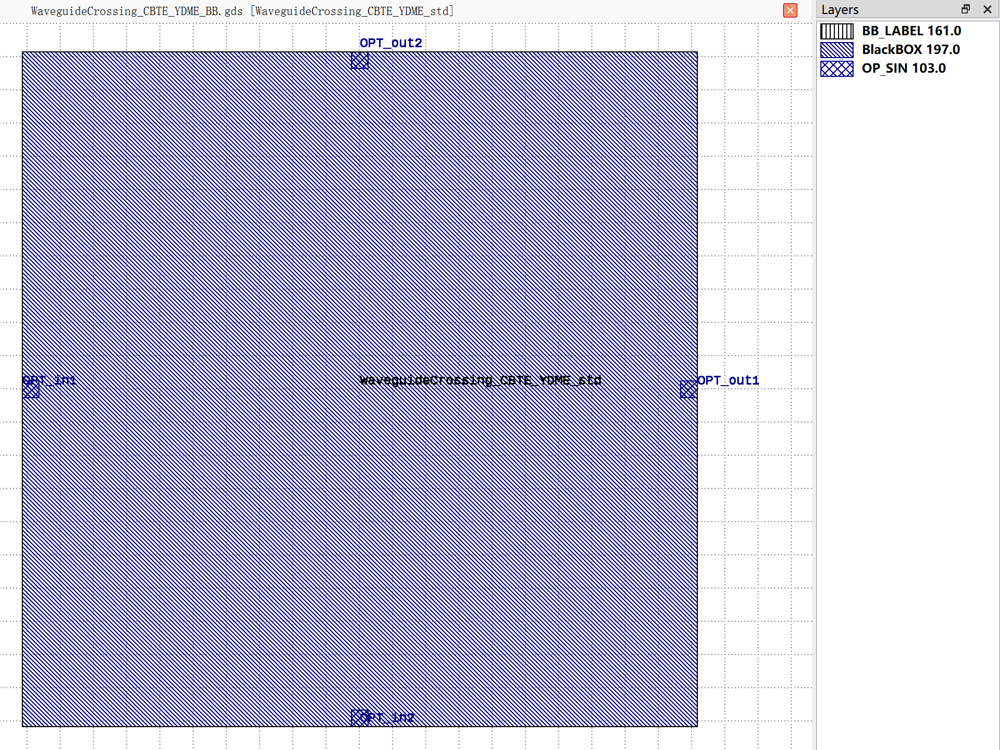

WaveguideCrossing_CBTE_YDME
#############################

+-------------------+-----------------------------+------------------------+------------------------+-------------+
|     Name          | Type                        | position               | Waveguide Type         | Degrees     |
+===================+=============================+========================+========================+=============+
| OPT_in1           | Optical                     | (-20.3, 0)             | TECH.WG.STRIP.C.WIRE   | 180         |
+-------------------+-----------------------------+------------------------+------------------------+-------------+
| OPT_in2           | Optical                     | (0, -20.3)             | TECH.WG.STRIP.C.WIRE   | -90         |
+-------------------+-----------------------------+------------------------+------------------------+-------------+
| OPT_out1          | Optical                     | (20.3, 0)              | TECH.WG.STRIP.C.WIRE   | 0           |
+-------------------+-----------------------------+------------------------+------------------------+-------------+
| OPT_out2          | Optical                     | (0, 20.3)              | TECH.WG.STRIP.C.WIRE   | 90          |
+-------------------+-----------------------------+------------------------+------------------------+-------------+

