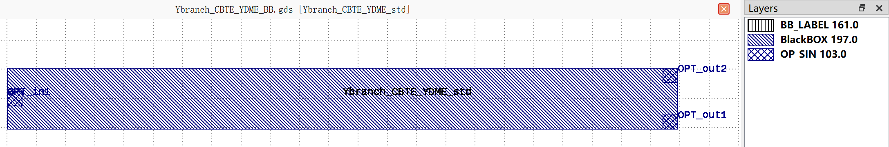

Ybranch_CBTE_YDME
#############################

+-------------------+-----------------------------+------------------------+------------------------+-------------+
|     Name          | Type                        | Position               | Waveguide Type         | Degrees     |
+===================+=============================+========================+========================+=============+
| OPT_in1           | Optical                     | (0, 0)                 | TECH.WG.STRIP.C.WIRE   | 180         |
+-------------------+-----------------------------+------------------------+------------------------+-------------+
| OPT_out1          | Optical                     | (45.81, -1.606)        | TECH.WG.STRIP.C.WIRE   | 0           |
+-------------------+-----------------------------+------------------------+------------------------+-------------+
| OPT_out2          | Optical                     | (45.81, 1.606)         | TECH.WG.STRIP.C.WIRE   | 0           |
+-------------------+-----------------------------+------------------------+------------------------+-------------+
