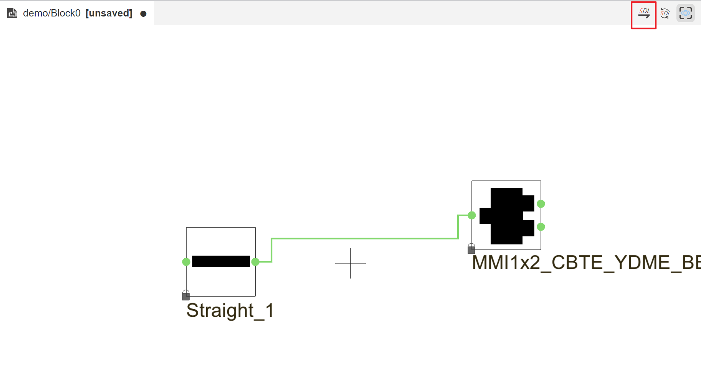

AdvancedSDL
=======================================

Import YD 300NITAL PDK into AdvancedSDL
*******************************************

Copy the **YD 300NITAL PDK** folder to the **AdvancedSDL** installation path: ``...\ASDL\Python\Lib\site-packages``. It can also be placed in other paths that do not contain special symbols such as Chinese characters and Spaces, so that python does not fail to identify the path.

Click ``PDK`` on the top toolbar of **AdvancedSDL** and select ``Open PDK Symbol Design``.

Locate and select the YD PDK folder.

After the import is complete, you will see the **YDME PDK** component library on the left.

Click ``File`` and then click ``New Project``.

Enter the project name and path, select **YD PDK** in the PDK column, and click ``OK``.

Wait for the contents of ``Import YD_300NITAL_V1p5_Latitudeda pdk symbols succeed`` to appear in the output.

Right-click on the ``circuits`` of the project, click ``New Circuit``, type ``Circuit Name`` and click ``Save``.

Drag components to the center region. Click on the component, the parameters of the component can be adjusted on the right side.

Once the parameters are set, connect the ports to route the components and click SDL in the upper right.

The corresponding layout is displayed in the ``Layout View``. And it generates python layout code called ``Generated-Script.py``, which can be run and used in **PhotoCAD**.

The ``Generated-Script.py`` can be run in **PhotoCAD** and modified to create a new layout. The script is saved in the project's Temp folder.

.. image:: ../images/ASDL_12.png

You can also easily import a specific component to **AdvancedSDL** on **PhotoCAD** using ``fp.export_schematic``. See ``gpdk > examples`` for more information.